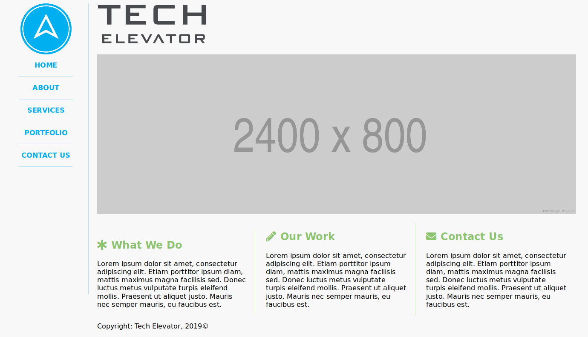

# CSS Exercise

Without changing the HTML (unless you absolutely need to), try to create a layout that reproduces what is shown in the provided image.

Here are some design decisions to be aware of:

* The side bar width is 200px
* The top row (logo and heading) is 150px tall.
* Only the content on the right scrolls if the page is longer than the viewport.
* Here are the following color styles:
    - Blue: #00ADEE;
    - Blue Border: rgba(0, 173, 238, 0.4);
    - Green: #8CC36F;
    - Green Border: rgba(170, 239, 135, 0.8);
    - Background Color: rgba(192, 192, 192, 0.1);
    - Subheading Color: rgba(0, 0, 0, 0.6);
