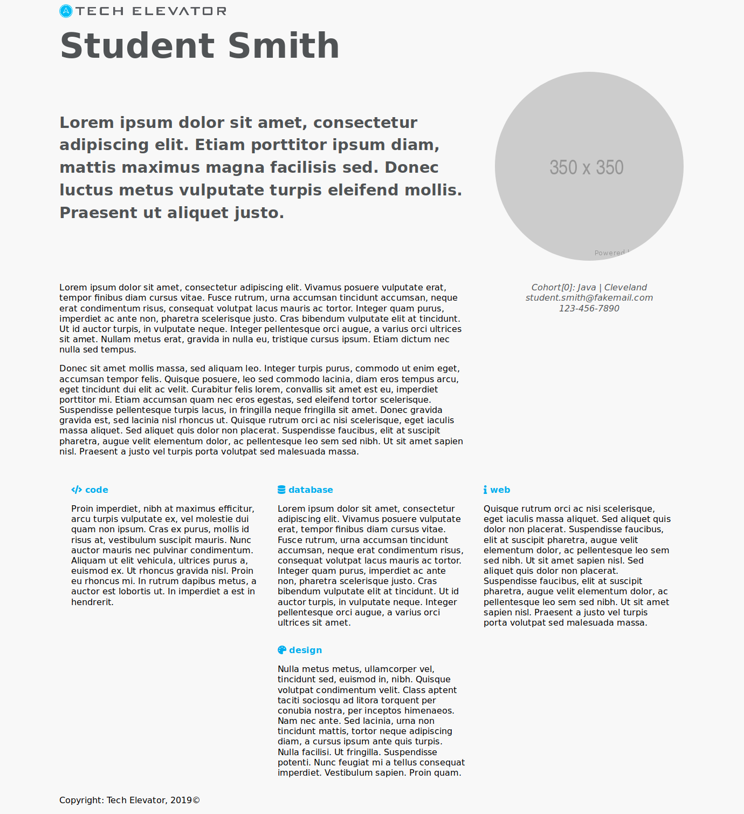

# CSS Exercise

Without changing the HTML (unless you absolutely need to), try to create a layout that reproduces what is shown in the provided image.

Here are some design decisions to be aware of:

* The page uses a grid layout.
* The columns in the grid are evenly sized.
* The margins on the side are: 8%
* The gaps between the grid cells are 20px vertically and 50px horizontally.
* The experience section should use a flexbox layout.
* Here are the following color styles:
    - Blue: #00ADEE;
    - Grey: #505355
    - Background Color: rgba(192, 192, 192, 0.1);