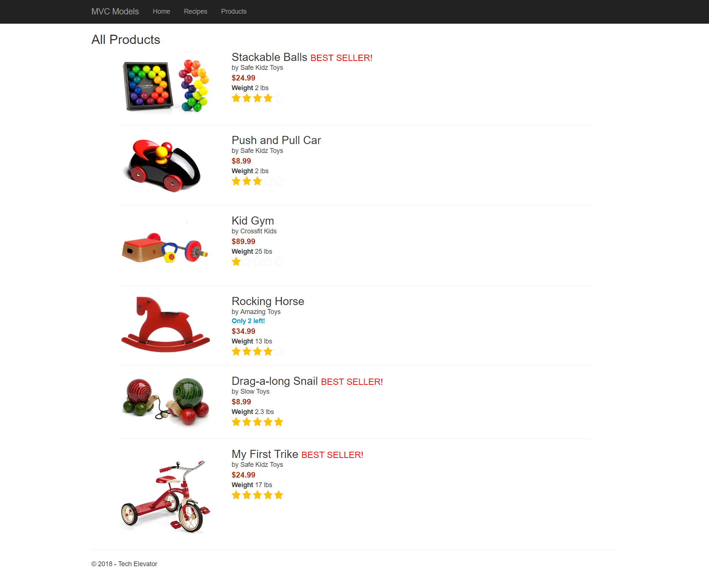
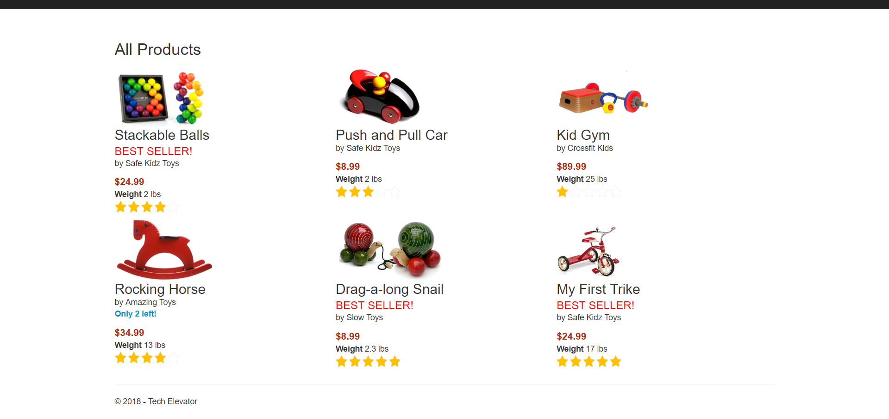
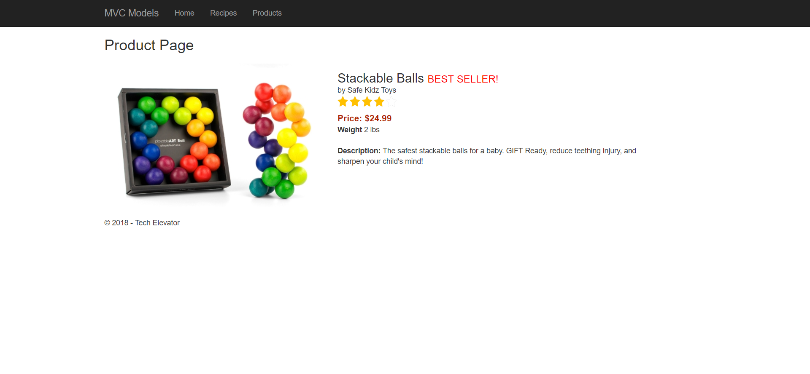

# Products Exercise

In this exercise you'll be creating 3 different views that work with a `Product` model object. For each of these a controller has already been created (the Products controller). Your job is to develop the 3 different views. Please note the wire frames are attached for you to reference when developing a final layout. For an example of what a finished view looks like, see the end of the README.

1. A list view of the products
    - `http://localhost:xxxxx/products/`
    - `http://localhost:xxxxx/products/index`

1. A tile view of the products
    - `http://localhost:xxxxx/products/tile`

1. A view of a single product to see it in further detail
    - `http://localhost:xxxxx/products/detail/SKU-1234`
    - `http://localhost:xxxxx/products/detail?id=SKU-1234`
        

If a product is a best seller, display **BEST SELLER!**

For the views that display list of products, create a hyperlink (with the product name and the image) that navigates the user to the associated recipe detail page.

## Scoring Guidelines

A **2** is achieved by displaying all of the proper data on the page.

A **3** is achieved by displaying the proper data with the layout that resembles the wire frame.

If you feel that you need additional assistance with HTML & CSS, please let us know so that we can offer additional practice and direction.

## Example Layouts

### List View

### Tile View

### Detail View

