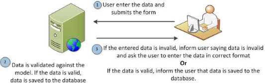

# Server Side Validation & ViewModels

## Problem Statement

HTML Forms are the front door to our web applications. If we don't secure it, we put too much trust and hope that they don't break our web application.

- *What types of invalid input might users provide?*
    - Not a number
    - Not a valid value
    - Incorrect format
    - etc.

- *Why might users type in invalid input?*
    - They don't know any better
    - They are trying to break the web application

- *What types of things could go wrong with invalid input?*
    - Data input may not standardized.
    - Our web application could be the victim of malicious input.

## Objectives

* Client & Server Validation
* Server Validation Rules
* Applying Validation
* Handling Validation Failures
* ViewModels

## Outline

### **1. Client & Server Validation**

- There are two locations where validation should be applied

- Client Validation
    - Blocks the browser from sending the request, eliminating the need for a full page load
    - Provides better feedback to the user
    - Eliminates the need for a request/response round-trip
    - Uses Javascript
    - Can be bypassed

- Server Validation
    - Occurs when the request is received
    - Protects the server from malicious input
    - If a hacker bypasses the UI provided, they cannot bypass server-side validation
    - Uses Java/C#

### **2. Types of Server Validation**

- *What type of data might we validate for?*
    - Required Values
    - Minimum / Maximum Length
    - Within acceptable range of values
    - Password matches
    - Valid type (credit card, email address, date, phone-number)
    - Pattern Match (regular expression)
    - etc.

### **3. How to Apply Validation**

- Validation needs to be applied to the values within our models

#### .NET

- We need to use Data Annotations on our Models to indicate what values are acceptable
- The namespace `System.ComponentModel.DataAnnotations` needs to be added to each model. This approach allows us to provide server-side validation and ultimately line us up for client-side validation too.
    - **`[Required]`** - Indicates a property is required to have a value
    - **`[StringLength(int)]`** - indicates a maximum length for the property
    - **`[StringLength(int, MinimumLength=int)]`** - indicates a maximum and a minimum length for a property
    - **`[Range(min, max)]`** - provides a minimum and maximum range for a numeric property
    - **`[Compare(propertyName)]`** - ensures two properties are equilavent
    - **`[EmailAddress]`** - validates the field as an email address

- The validation attributes have additional properties/parameters (e.g. **`[Required(ErrorMessage = "This field must have a value")]`**
- Add `@Html.ValidationMessageFor(m => m.PropertyName)` to add the validator to the form.

<div class="csharp note">
<em>Semi-related to validation</em>, this is a possible time to introduce the <code>[DataType]</code> attributes and <code>[Display]</code> attributes. This sets us up to be able to use <strong><code>Html.EditorFor(m => m.Property)</code></strong>
</div>

- Sample `[DataType]` attributes
    - `[DataType(DataType.Date])`
    - `[DataType(DataType.DateTime])`
    - `[DataType(DataType.EmailAddress])`
    - `[DataType(DataType.Password])`
    - `[DataType(DataType.Text])`
    - `[DataType(DataType.Url])`

#### Java

- We need to use Bean Validation Annotations (JSR-303/JSR-349 Bean Validation) on our Models to indicate what values are acceptable
- There are a number of different validations we can use on our Model's attributes:
    - **`@NotNull`** - Indicates an Object can't be null (must be set)
    - **`@NotEmpty`** - Indicates a String, Collection or array must not be empty
    - **`@NotBlank`** - Indicates a String contains more than just whitespace
    - **`@Size(min=minValue)`** - indicates a maximum length for a String, Collection or array
    - **`@Size(min=minValue, max=maxValue)`** - indicates a maximum and a minimum length  for a String, Collection or array
    - **`@Min(value=minValue)`/`@Max(value=maxValue)`** - provides a minimum and maximum value for a numeric property (Including BigDecimal)
    - **`@Range(min=minValue, max=maxValue)`** - provides a minimum and maximum range for a numeric property (Including BigDecimal
   - **`@Email`** - validates the field as an email address

- Important to remember that most validations don't check for Null values. Be sure to add `@NotNull` or `@NotEmpty` if you want to verify that a value is set.
- The validation attributes have additional properties/parameters (e.g. **`@NotBlank(message = "This field must have a value")`**
- In your controller, you can annotate your POST controller action with @Valid to check the Model when it's passed in.

``` java
	@RequestMapping("/formSubmit")
	public String handleForm(@Valid @ModelAttribute("person") Person person, BindingResult result) {
		if (result.hasErrors()) {
	        return "form";
	    }

		return "redirect:/thankYou";
	}
```
- Add `<form:errors path="*" cssClass="error" />` or `<form:errors path="firstName" cssClass="error" />` to add the error messages to the form.

### **4. What to Do When Validation Fails**



<div class="analogy note">Our controller can be the traffic cop. It is responsible for enforcing validation checks and if they fail notifying the user with the appropriate view.</div>

### **5. View Models**

<div class="definition note">A <strong>model</strong> is a data entity that interacts with our application.</div>

<div class="definition note">A <strong>view model</strong> is a simple class that interacts with our view.</div>

**Applicable Scenarios**
- Creating Views that comprise of data from different models
- Creating a Multi-Page Application Form. It spans multiple views but constitutes a single model.