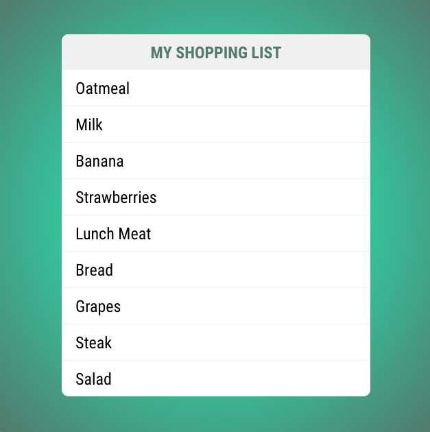
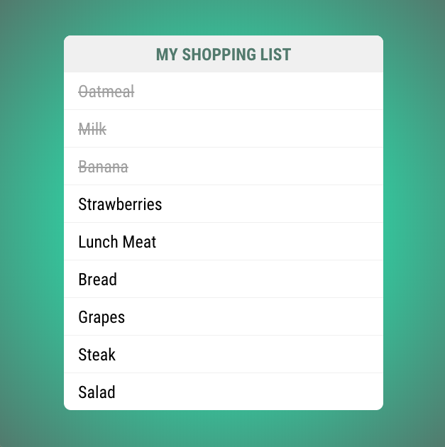

# Student Exercise for Introduction to Vue.js

In this exercise you will take everything you learned today and build your own Vue application that contains a custom component. You are going to build a small shopping list application that displays a list of items you need to purchase from the grocery store. 

These are some guidelines for building this application:

* Create a new vue project called shopping-list `vue create shopping-list`
* Create a custom component called ShoppingList
    * This will be very similar to the todo list tutorial
    * Should be based on a `<ul></ul>`
    * Should contain more than 1 `<li></li>`
* Import your shopping list component in App.vue
* Display your shopping list
* Run your application and verify that you have a shopping list

## Shopping List Styles

If you want to give you shopping list component some style you can use the following. First in `App.vue` add the following style for the body: 

```html
<style>
body {
  background: rgb(61,201,164);
  background: radial-gradient(circle, rgba(61,201,164,1) 50%, rgba(92,133,120,1) 100%);
}
</style>
```

And in `ShoppingList.vue` add the following styles: 

```html
<style>
.shopping-list {
    width:450px;
    background: #fff;
    margin: 50px auto;
    font-family: 'Roboto Condensed', sans-serif;
    border-radius: 10px;
}
h1 {
    background:#f2f2f2;
    color:#5c8578;
    padding:10px;
    font-size:24px;
    text-transform: uppercase;
    text-align: center;
    margin-bottom: 0px;
    border-top-left-radius: 10px;
    border-top-right-radius: 10px;
}
ul {
    list-style-type: none;
    margin:0px;
    padding:0px;
}
li {
    font-size: 24px;
    border-bottom:1px solid #f2f2f2;
    padding:10px 20px;
}
li:last-child{
    border:0px;
}
li.completed {
    text-decoration: line-through;
    color:darkgrey;
}
</style>
```

If you completed the exercise you should have a list of items on your shopping list. Here is my shopping list:



## Completed Class

To give your shopping list a little style add a class called `completed` to a few of the items. To give it the appearance of completed you will want to change the font color to dark grey and add a line through the item. If everything goes well you should end up with something that looks like this.




## Exercise Tests

To consider your exercise a success we will run an automated test against it. Those tests will check for the following criteria.

* You should have a shopping ist on your page that is made up of an `<ul></ul>` and more than 1 `<li></li>`.
* At least 1 of your list items should have a class of `completed`.

