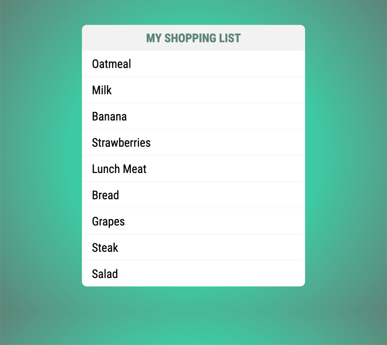
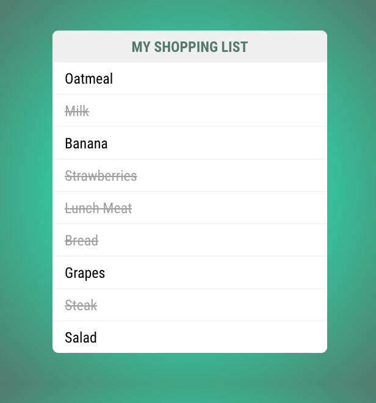

# Vue Data Binding Exercise

In this exercise you are to build on the shopping list that you built in an earlier exercise. The starter code for this exercise is located in the `shopping-list` folder. 

* In the `ShoppingList.vue` component remove the hard coded list of items. 
* Create a new empty array called `groceries`
* Add 9 groceries to your array (Simple Strings)
* Display those in your template using a v-for directive. 

If everything went right you should end up with something like this. 



Instead of using simple strings for your grocery list you are going to enhance your shopping list to use objects. 

* Each item in the groceries array should be an object
* Each object should contain the following properties
    * item: The item in the shopping list
    * completed: Did you already get the item
* Now that you are looping over a list of objects your v-for will need to be updated. 
* Bind the class of the list item to the objects completed property. 

Any item that you marked `completed: true` should now be crossed out. 




## Exercise Tests

To consider your exercise a success we will run automated tests against it. Those tests will check for the following criteria.

* You should have a shopping ist on your page that is made up of an `<ul></ul>` and 9 `<li></li>`.
* At least 3 list items should have a class of `completed`.

If you want to run the tests you can run the following command

```bash
npm run test:unit
```