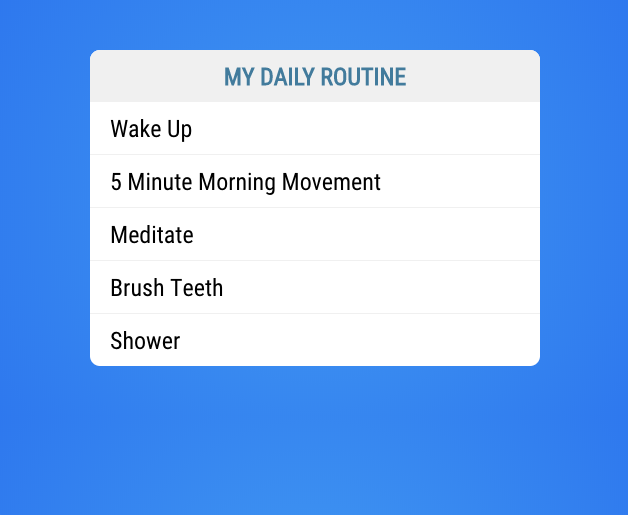

# Vue Data Binding Tutorial

In this tutorial you will be building on the todo app we saw in an earlier example. You will need to open up the todo application in this folder and follow the instructions below to complete the tutorial.

## NPM Install

If you remember from the student book this is an existing project that has some dependencies that aren't stored in source control. To Install your projects dependencies run the following command: 

```bash
npm install
```

## Todos Application

The first thing you need to do is to open up the `TodoList.vue` component and remove all of the hard coded list items.

```html
<template>
    <div class="todo-list">
        <h1>My Daily Routine</h1>
        <ul>
            <li>Wake Up</li>
            <li>5 Minute Morning Movement</li>
            <li>Meditate</li>
            <li>Brush Teeth</li>
            <li>Shower</li>
        </ul>
    </div>
</template>
```

Now that you have a little bit of an understanding of what data binding is you are going to create an array of todo items and use `v-for` to display them in your list. 

First you will need to create an empty array inside the return of the data function.

```javascript
<script>
export default {
  data() {
    return {
      todo: []
    }
  }
}
</script>
```

Now you can take your list items that you were using before and just add them to the todo array. 

```javascript
<script>
export default {
  data() {
    return {
      todos: [
          'Wake up',
          '5 Minute Morning Movement',
          'Meditate',
          'Brush Teeth',
          'Shower'
      ]
    }
  }
}
</script>
```

Now that you have an array of todo items it's time to display them in the list. To make this happen you are going to use the `v-for` directive. Place the following code inside of the `<ul></ul>` tags in your template. 

```html
<li v-for="todo in todos" v-bind:key="todo">{{todo}}</li>
```

You should be able to run the application using `npm run serve`, visit http://localhost:8080 and see the same list you had before. 



The difference now is you aren't hard coding the values in the markup. You did hard code them into a todo array but then you were able to dynamically iterate over that array and display them in your list. 

