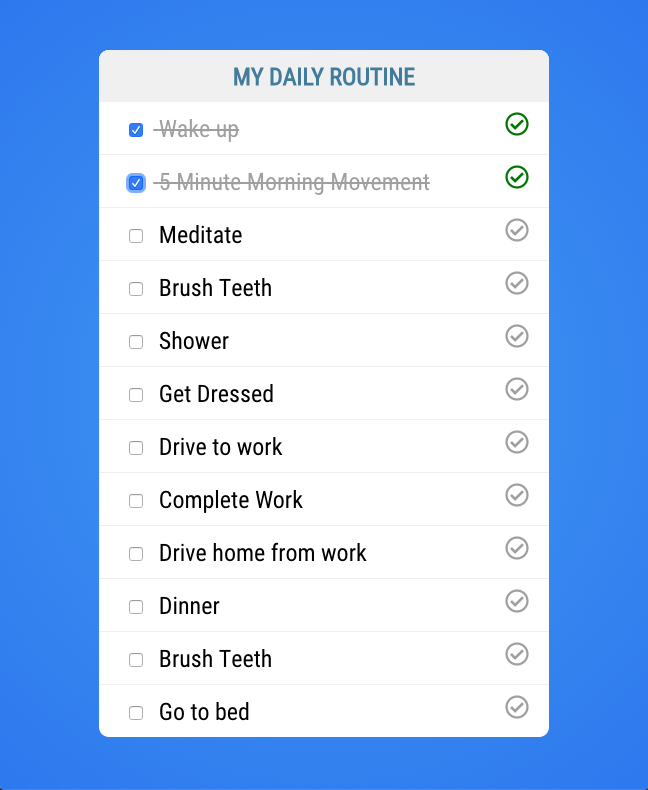

# VueJS Event Handling Tutorial

In this tutorial you are going to work on event handling in VueJS. You are going to take the Todo List you have been building out and add some interactivity to it. The starter files for this tutorial are located in the `todo` folder. 

The current application works and marks a task as completed as long as the completed property is set to true. What you are going to do is add an event handler so that when a task is checked it marks that item as completed in the array. 

The first thing you need to do is to add a checkbox to the left of the task.

```html
<li v-for="todo in todos" v-bind:key="todo.task" v-bind:class="{'todo-completed': todo.completed}">
    <input type="checkbox"/>
    {{todo.task}} <i class="far fa-check-circle" v-bind:class="{completed: todo.completed}"></i>
</li>
```

Next you will add a click event handler that calls a method called `changeStatus()`. 

```html
<input type="checkbox" @click="changeStatus()"/>
```

With that event handler attached to our checkbox you need to define that method. In your JavaScript create a new methods block and define the change status method. 

```javascript
methods: {
    changeStatus() {
        
    }
}
```

So far everything seems like you're on the right track but you have a problem. How will you be able to tell that the 1st or the 5th item in the list was checked? To distinguish between them you can add an id to each of the elements in the array. 

```javascript
data() {
    return {
        todos: [
            { id: 1, task: 'Wake up', completed: false },
            { id: 2, task: '5 Minute Morning Movement', completed: false },
            { id: 3, task: 'Meditate', completed: false },
            { id: 4, task: 'Brush Teeth', completed: false },
            { id: 5, task: 'Shower', completed: false },
            { id: 6, task: 'Get Dressed', completed: false },
            { id: 7, task: 'Drive to work', completed: false },
            { id: 8, task: 'Complete Work', completed: false },
            { id: 9, task: 'Drive home from work', completed: false },
            { id: 10, task: 'Dinner', completed: false },
            { id: 11, task: 'Brush Teeth', completed: false },
            { id: 12, task: 'Go to bed', completed: false }
        ]
    }
}
```

Now that you have an id associated with each task you need to update the key in your `v-for` directive to be the id. 

```html
<li v-for="todo in todos" v-bind:key="todo.id" :class="{'todo-completed': todo.completed}">
```

You can also pass that id to your change status method so you know what list item you're dealing with. 

```html
<li v-for="todo in todos" v-bind:key="todo.id" v-bind:class="{'todo-completed': todo.completed}">
    <input type="checkbox" v-on:click="changeStatus(todo.id)"/>
    {{todo.task}} <i class="far fa-check-circle" :class="{completed: todo.completed}"></i>
</li>
```

Finally you can accept that id in your change status method as an argument and update the list item. Before you take a look at the solution below try to think about how you would update the list item to the opposite of what it currently is. You can't just set it to false because if the user un-checks it the task would still show as completed.

```javascript
changeStatus(id) {
    // update the list item
}
```

As you know JavaScript arrays are 0 based index. In our example you know that the first element is 1 and the rest of the tasks are in sequential order. You could simply take the id and subtract 1 to get the index of the array. 

```javascript
changeStatus(id) {
    this.todos[id-1].completed = // right side of assignment here
}
```

This will work in this example but as soon as your id's aren't in sequential order this will break. You can use the [Array.findIndex](https://developer.mozilla.org/en-US/docs/Web/JavaScript/Reference/Global_Objects/Array/findIndex) method to return the index of the element that satisfies the testing function. Your test will be does the id of a an object in the array match the id that got passed to my change status method. 

```javascript
changeStatus(id) {
    const arrIndex = this.todos.findIndex((todo) => todo.id == id);
    this.todos[arrIndex].completed = // right side of assignment here
}
```

Now that you have the correct object in the array you can change the status to whatever the inverse is of the current status. If it's currently true it will set it to false and if it's currently false it will be set to true. 

```javascript
changeStatus(id) {
    const arrIndex = this.todos.findIndex((todo) => todo.id == id);
    this.todos[arrIndex].completed = !this.todos[arrIndex].completed;
}
```

If you did everything correctly you should be able to run `npm run serve`, navigate to http://localhost:8080 and now whenever you check a task it will mark it the opposite of what it is. 



If you were to refresh the page everything will be reset because you aren't saving that state anywhere yet. 