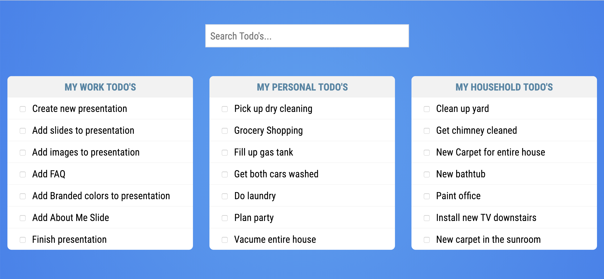

# Vue Nested Components Tutorial

In this tutorial you are to enhance the todo application. You are going to use that Todo List Component to create 3 separate lists and then create a search component that can notify each of the lists what the user is searching for. This will be a great introduction for you as to how components communicate with each other. The todo application starter code is located in the `todo-lists` folder inside of this directory. 

## Project Starter Code

If you run the starter code for this tutorial you should see something that looks similar to this. 



What we are going to do is start with the search component and learn how to communicate with our Todo List components. 

## Search Component

As the user starts typing you want to capture that input. The way that you can do that is by listening for the keyup event on the search input. You can do so by using `v-on:keyup` or the shorthand `@keyup`. 

```html
<input type="text" id="search" name="search" v-on:keyup="filterTasks" placeholder="Search Todo's..."/>
```

The string inside of the event is the function that will be called when this event is triggered. When the function is called you will get the value of the search box. Now that you have the value of what the user is searching for you need to communicate that value to each of the list components. The way that you do this is by emitting a custom event. 
You will then take that value and emit a new custom event called `filter-tasks`. 

```javascript
filterTasks() {
    const query = document.getElementById('search').value;
    this.$emit('filter-tasks', query);
}
```

The first argument ot the `$emit` method is the name of the event and the second is the data you wish to pas along with it. From the search components standpoint that is all you need to do. 

## App.vue

Now that you have your search component working you need to listen for the custom event that it will now be emitting. You can use the same approach that you used to listen for the built in keyup event for your custom event. On your `todo-search` component you will listen for the filter-tasks event.

```html
<todo-search v-on:filter-tasks="handleSearch"></todo-search>
```

When the filter-tasks event is emitted the handleSearch method will be called and passed the search query. You need to create that method and accept the query as an argument. You will need to create a new variable in your data() functions return object to hold the search term. 

``` javascript
data() {
    return {
      search: '',
      work: [],
      personal: [],
      household: []
    }
},
methods: {
    handleSearch(query) {
        console.log('Filter Tasks: ', query);
        this.search = query;
    }
}
```

The reason you do this is because we can now use data binding on your list components so that anytime that value is changed your lists are updated. You will do this by adding the `v-bind:search` directive or shorthand `:search`. 

```html
<todo-list title="My Work Todo's" v-bind:todos="work" v-bind:search="search" ></todo-list>
<todo-list title="My Personal Todo's" v-bind:todos="personal" v-bind:search="search" ></todo-list>
<todo-list title="My Household Todo's" v-bind:todos="household" v-bind:search="search" ></todo-list>
```

The value `v-bind:search` is the name of the prop in the `TodoList` component. The value inside of the quotation marks is variable you're binding to. These don't need to be the same name but in most cases it simplifies things and makes it easier to read if they are. 

## TodoList Component

Now that your search component is emitting a custom event, you are listening for that event and then passing the search query to your list component all that is left to do is filter our data. 

Right now we are using data binding to pass in the array of data for each list using `:todos="work"`, `:todos="personal"` and `:todos="household"`. Then in your `TodoList` component you simply loop over the todos and display them. 

```html
<li v-for="todo in todos" 
    v-bind:key="todo.id" 
    v-bind:class="{'todo-completed': todo.completed}" 
    v-on:click="changeStatus(todo.id, $event)">
    <input type="checkbox"/>
    {{todo.task}} <i class="far fa-check-circle" v-bind:class="{completed: todo.completed}"></i>
</li>
```

## Computed Properties 

Now that the users search term is getting passed to your TodoList component how can you filter your lists? As you already learned in an earlier lesson computed properties are a great solution to this problem.

Computed properties are a great way to manipulate data that already exists. In your case you already have an array of tasks and you just want to filter out items that don't match the search term. When you're building something where you need to sort through a large group of data and you don't want to rerun those calculations on every keystroke, think about using a computed value. 

The first thing you need to do is create your computed property. You are going to use a Regular Expression so you don't have to worry about comparing case and then use the [filter](https://developer.mozilla.org/en-US/docs/Web/JavaScript/Reference/Global_Objects/Array/filter) method which will create a new array with all of the elements that pass your function test. 

```javascript
computed: {
    filteredTasks() {
        const filter = new RegExp(this.search,'i');
        return this.todos.filter(todo => todo.task.match(filter));
    }
}
```

Now in your `v-for` directive instead of looping over the todo's array you can loop over your `filteredTasks` computed property. 

```html
<li v-for="todo in filteredTasks" 
    v-bind:key="todo.id" 
    v-bind:class="{'todo-completed': todo.completed}" 
    v-on:click="changeStatus(todo.id, $event)">
    <input type="checkbox"/>
    {{todo.task}} <i class="far fa-check-circle" v-bind:class="{completed: todo.completed}"></i>
</li>
```

And you will end up with the same filtered lists but you will get there with a better solution. This is due to computed properties caching results when data doesn't change. To learn more about this please read through the [Vue Documentation](https://vuejs.org/v2/guide/computed.html). 


