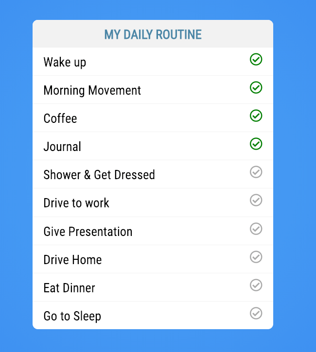

# Fetch & Promises Tutorial

In this tutorial we are going to stick with out Todo theme but we are going to make a couple small changes. 

First we are going to leave Vue for the day and work in Vanilla JavaScript. The reason for this is so that we can learn how to use the Fetch API and understand Asynchronous programming outside of a framework. Second we are going to introduce a new tag in HTML called `The HTML Content Template element`. 

## Getting Started

In this directory you should have a `todo-fetch` folder that contains the following files: 

* **index.html** This is the markup for this application.
* **data.json** The JSON file will hold the data that drives our application. 
* **assets/css/main.css** The look and feel for our application.
* **assets/js/todo.js** This is an empty JavaScript file and will be where you will be doing all of your work today. 

When you complete the project you should see something like this



## JSON Data

If this your first time seeing a `.json` file don't worry. JSON stands for JavaScript Object Notation. JSON is a lightweight format for storing and transporting data. As you begin to work with web services you will often find that those services return data to you in JSON format. JSON is "self-describing" and easy to understand. 

For now you are going to open up `data.json`, insert the following code and save it. 

```
[
  {"task" : "Wake up", "completed":true}, 
  {"task" : "Morning Movement", "completed":true}, 
  {"task" : "Coffee", "completed":true}, 
  {"task" : "Journal", "completed":true}, 
  {"task" : "Shower & Get Dressed", "completed":false}, 
  {"task" : "Drive to work", "completed":false}, 
  {"task" : "Give Presentation", "completed":false}, 
  {"task" : "Drive Home", "completed":false}, 
  {"task" : "Eat Dinner", "completed":false}, 
  {"task" : "Go to Sleep", "completed":false}
]
```

As you can see JSON is very easy to look at and understand what is going on here. This is a list of tasks that you will use to build your Todo application. 

## Fetch 

Now that you have a list of tasks you need to read them. As you saw in the reading material the best way to accomplish this is by using the Fetch API. The fetch method takes the url of the resource we are calling, in this case `data.json` is in the same directory. 

```javascript
// read the tasks from data.json
fetch('data.json')
  .then((response) => {
    // get the JSON from the response
    return response.json();
  })
  .then((todos) => {
    // when the JSON data is returned log the result
    console.log(todos);
  })
  .catch((err) => {console.error(err)});
```

Now that you have an array of todos you need to display them on the page and that is where a new concept is going to come into play. 

## The HTML Content Template

At the beginning of this tutorial I mentioned that we would be introducing a new concept and here we are. We are going to be using a new HTML tag `<template>` which is often refereed to as [The HTML Content Template](https://developer.mozilla.org/en-US/docs/Web/HTML/Element/template).


> The HTML Content Template `<template>` element is a mechanism for holding client-side content that is not to be rendered when a page is loaded but may subsequently be instantiated during runtime using JavaScript.
>
> Think of a template as a content fragment that is being stored for subsequent use in the document. While the parser does process the contents of the `<template>` element while loading the page, it does so only to ensure that those contents are valid; the element's contents are not rendered, however.

### Templates in VueJS

If this tag looks familiar its because we have used it before. You used this when you created a Single File Component in Vue. The code below is from from a TodoList.vue component you created in an earlier lesson. 

``` html
<template>
  <div class="todo-list">
    <h1>My Daily Routine</h1>
    <ul>
      <li v-for="todo in todos" 
        v-bind:key="todo.id" 
        v-bind:class="{'todo-completed': todo.completed}" 
        v-on:click="changeStatus(todo.id, $event)">
        <input type="checkbox"/>
        {{todo.task}} <i class="far fa-check-circle" v-bind:class="{completed: todo.completed}"></i>
      </li>
    </ul>
  </div>
</template>

<script>
  // ...
</script>

<style>
  /* ... */
</style>
```

The markup for you component is declared inside of a `<template>` tag. The template tag never actually gets rendered to the DOM. Vue.js uses an HTML-based template syntax that allows you to declaratively bind the rendered DOM to the underlying Vue instance’s data. All Vue.js templates are valid HTML that can be parsed by spec-compliant browsers and HTML parsers.

### Templates in HTML & Vanilla JavaScript

Now that you know what the `<template>` tag is and how its used inside of Vue we can take a look at how its used in HTML & Vanilla JavaScript. As the MDN Documentation stated 

> Think of a template as a content fragment that is being stored for subsequent use in the document.

In the context of this tutorial you want to read in some data from a JSON file and apply it to your template. You could certainly do this without a template but it becomes very cumbersome to create complex fragments using JavaScript. 

If you look in `index.html` you should see the following template. What we are going to do is use this as the content template for each task that you display on the page.

``` html
<template id="tasks">
  <li class="">
    <i class="far fa-check-circle"></i>
  </li>   
</template>
```

### Displaying Tasks

Now that you know what a template is and why we introduced it for this tutorial you can finish building out this application. Just to recap you have already used fetch to read in your JSON data. We will continue adding to our application where we have our todos array. 


```javascript
fetch('data.json')
  .then((response) => {
    return response.json();
  })
  .then((todos) => {
    // START HERE
  })
  .catch((err) => {console.error(err)});
```

The first thing you need to do is test to see if the browser supports HTML template. As long as you're using a modern web browser it [should support it](https://caniuse.com/#feat=template).

``` javascript
// Test to see if the browser supports the HTML template element by checking
// for the presence of the template element's content attribute.
if ('content' in document.createElement('template')) {
  // OK, lets do some work
}
else {
  // Find another way to add list items to your list 
  // the HTML template element is not supported.
  console.error('Your browser does not support templates');
}
```

You are going to create list items using the templates but you need a container element to append them to. If you look in the HTML you will see there is an unordered list and this makes for a great parent element. You just need to get a reference to that element. 

```javascript
const list = document.querySelector("ul");
```

Next you will iterate over each item in the todo's array. 

``` javascript
todos.forEach((todo) => {
  // each todo in our array

});
```

Remember a template here is like a template in anything else you have used. It's a base for what you want each of your "things" to look like. Here you have a template for what each list item should look like. 

The first thing you need to do is get a reference to that template, get the [content](https://developer.mozilla.org/en-US/docs/Web/API/HTMLTemplateElement/content) (what's in between the `<template></template>` tags) and then clone it. The cloneNode method takes an argument that is used to determine if you want to clone just the top level node or to also include all the children (deep clone). 

``` javascript
const tmpl = document.getElementById('tasks').content.cloneNode(true);
```

Now that you have your tmpl reference you can query it just like you do the entire document. If you wanted to add the task name to the list item you could find the `<li>` and then set the innerHTML. Finally you can use your top level container `<ul>` list and append your new list item. 

``` javascript
tmpl.querySelector("li").innerHTML = todo.task;
list.appendChild(tmpl);
```

This would work if we didn't have a child (`<i>`) element. In your case you have an icon to show if the task has been completed or not. If you set the innerHTML you would just override everything inside of the list item. Fortunately there is a method to solve this problem. The method [insertAdjacentHTML()](https://developer.mozilla.org/en-US/docs/Web/API/Element/insertAdjacentHTML) allows us to insert the text in a specific position. 

* 'beforebegin': Before the element itself.
* 'afterbegin': Just inside the element, before its first child.
* 'beforeend': Just inside the element, after its last child.
* 'afterend': After the element itself.

``` javascript
tmpl.querySelector("li").insertAdjacentHTML('afterbegin',todo.task);
list.appendChild(tmpl);
```

Finally you need to check to see if the task has been completed. If so you need to add the completed class to the icon to give it that green color and let the user visually see that the task has been completed. 

``` javascript
const tmpl = document.getElementById('tasks').content.cloneNode(true);
tmpl.querySelector("li").insertAdjacentHTML('afterbegin',todo.task);
if( todo.completed ) {
  const circleCheck = tmpl.querySelector('.fa-check-circle');
  circleCheck.className += " completed";
}
list.appendChild(tmpl);
```

## Todo Fetch Solution

If you followed along you should end up with a solution that looks similar to this: 

```javascript
fetch('data.json')
  .then((response) => {
    return response.json();
  })
  .then((todos) => {
    if('content' in document.createElement('template')) {
      const list = document.querySelector("ul");
      todos.forEach((todo) => {
        const tmpl = document.getElementById('tasks').content.cloneNode(true);
        tmpl.querySelector("li").insertAdjacentHTML('afterbegin',todo.task);
        if( todo.completed ) {
          const circleCheck = tmpl.querySelector('.fa-check-circle');
          const currentClass = circleCheck.className;
          circleCheck.className = currentClass + " completed";
        }
        list.appendChild(tmpl);
      });
    } else {
      console.error('Your browser does not support templates');
    }
  })
  .catch((err) => {console.error(err)});
```

