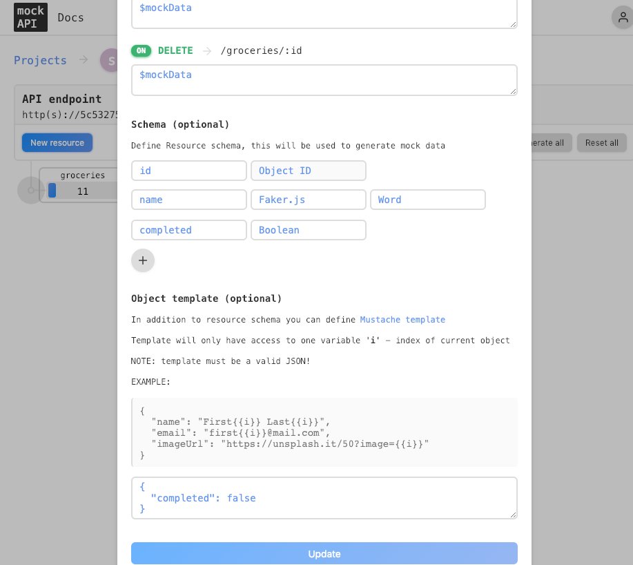

# REST APIs Exercise Solution

In this exercise you are going to make some additions to the shopping list application that you have been working on.

## mockAPI

The first thing you need to do is to setup your Mock API. This time you are going to create your own from scratch instead of cloning an existing one. Create a new endpoint with a resource named groceries. This resource should contain the following properties:

* id: Object ID
* name: Faker.js Word
* completed: Boolean

> Use Faker here so you can generate 10+ items without having to type out all of the data.



Please create at least **10 items** in your groceries resource.

## Exercise 

Now that you have your API setup you will want to copy your groceries endpoint. For this exercise you will be working entirely in the `ShoppingList.vue` component.

* Create a variable called API_URL and set the value to your groceries endpoint.
* When the component is `created` make a request to your API to get all of items
    * When you get back a result set the components instance data to the result of the API call
* Updating the completed status of an item
    * Currently when you check an item it updates the status locally. Update this logic so that the status is also updated in your API (on the server)
    * After you mark an item completed refresh the page. Do you notice anything wrong with the checkbox of the item you just updated? 
        * How can you fix this? 

## Automated Tests

For this project to be considered completed our integration tests all need to pass. If you look in the tests/e2e/specs directory you will see shopping-list-tests.js. To run the end to end tests you can run the following from the command line.

```
npm run test:e2e
```

* Your list should be 10 or more items
* When you click on a list item it should have the completed class
* When an item is completed the checkbox is checked.

