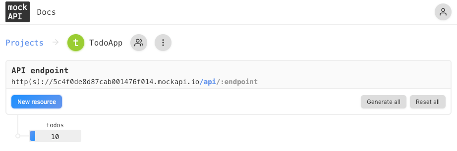

# REST APIs Tutorial

In this tutorial you are going to learn how to create a mockAPI so that you learn how to create a post request using the Fetch API. The starter code for this tutorial is located in the `todo-mock-api` in this directory.

## Mock API

In the student book you had a chance to check out mockAPI. If you haven't gone through the documentation and watch the screencast please take a few minutes to do so before continuing on with this tutorial. 

Before you can started with this tutorial you will need to clone an existing mockAPI. If you click on the link below it will take the schema and data from our TodoApp and clone it into your account.  

https://www.mockapi.io/clone/5c53257da659410014eeea11

**mockAPI Free Tier:** Please know that you can only have a single project on the free tier of mockAPI. If you already created one while you were going through the student book please delete it before trying to clone the TodoApp. 

If everything goes ok you should have a TodoApp project with 10 todos. Keep this open because you will need the URL of your API as you begin to build out this tutorial. 



## Vue App

Go into the starter code for this application and open your TodoList.vue component. In your data method update the apiURL variable with the your mockAPI endpoint which is located on the mockAPI page under TodoApp > API Endpoint.

``` javascript
data() {
  return {
    apiURL: "",
    todos: []
  };
}
```

Now that you have an empty array of todos and you API endpoint you can fetch a list of todos when the application starts. Before you can do that you need to learn about Vue's Lifecycle Hooks.

### Vue Lifecycle Hooks

Each Vue instance goes through a series of initialization steps when it’s created.

Below is a diagram for the instance lifecycle. You don’t need to fully understand everything going on right now, but as you learn and build more, it will be a useful reference.


All of the methods outlined in red are hooks provided by Vue that you can hook into. The `created` hook can be used to run code after an instance is created.

### Fetching Todos

Now that you know that these lifecycle hooks exist its time to start using them. To use one of these hooks you will need to create a method with the same name. While it may seem like these methods should go inside of the methods block they don't. These are special methods and need to belong outside of that object. 

``` javascript
export default {
  data() {
    return {
      apiURL: "",
      todos: []
    };
  },
  methods: {

  },
  created() {
    // run code after the instance has been created
  }
};
```

It is important to note that when you are in the created method events are active and you have access to reactive data. This means that you can make a call to your API to get a list of todos and then set them to your components instance data. 

``` javascript
created() {
  fetch(this.apiURL)
    .then(response => {
      return response.json();
    })
    .then(todos => {
      this.todos = todos;
    })
    .catch(err => console.log(err));
}
```

At this point you should be able to see your list of todos when the application loads. 

### Adding a new Todo

When a user clicks on the add todo button in the right hand corner of the title bar, the method `showTodo` is called because we defined a click event handler.

```html
<a href="#" class="btnAddTodo" v-on:click="showTodo">Add Todo
  <i class="fas fa-plus"></i>
</a>
```

The `showTodo` method handles the logic for displaying the add todo form that is hidden from the user by default.

```javascript
showTodo() {
  console.log("Add Todo...");
  // the list-item that contains the input box
  const form = document.getElementById("frmNewTodo");
  // the new todo form field
  const input = document.getElementById("new-todo");
  // the list-item is hidden by default
  form.removeAttribute("style");
  // set the focus to the input box so the user can start typing a new todo
  input.focus();
}
```

The input box in that form allows the user to type a new todo and hit enter to call the method `addTodo`. The way this works is by having a keyup event handler with a key modifier for the enter key. 

```html
<li id="frmNewTodo" style="display:none;">
  <input type="text" id="new-todo" placeholder="Add New Todo" v-on:keyup.enter="addTodo">
</li>
```

Now that you know how you got here its time to build out the `addTodo` method. 

``` javascript
addTodo() {
  // ADD NEW TODO HERE
}
```

Before you send a new request off to your API to add a new todo you need to build that request up. 

``` javascript
addTodo() {
  // get a reference to the new todo input box
  const newtodo = document.getElementById("new-todo");
  // get the value that the user typed in
  const task = newtodo.value;
  // If you want to send a long a new id for your todo you need to determine what the max id currently is
  // to do this you can collect all of the ids from the todos array and grab the Math.max()
  const maxid = Math.max(...this.todos.map(todo => todo.id));
  // create a new todo object with id, task and completed
  const todo = { id: maxid + 1, task: task, completed: false };
}
```

Now that you have a new todo object we can call your API with POST request to create a new one. You can use the same fetch method that you use to perform a GET and retrieve the initial todos. The fetch method takes an optional argument that is an object and contains some options for customizing your fetch request. 

``` javascript
// use fetch to create a new todo in our mockAPI.
fetch(this.apiURL, {
  method: "POST",
  headers: {
    "Content-Type": "application/json; charset=utf-8"
  },
  body: JSON.stringify(todo)
})
.then(response => {
  if (response.ok) {
    // if our post was successful add the todo to our todos array so the user can see it
    // the next time this page is refreshed the new task will be pulled from the server.
    this.todos.push(todo);
  }
})
.catch(err => console.error(err));
```

* **method:** The request method, e.q.. GET, POST, PUT, DELETE.
* **headers:** Any headers you want to add to your request, contained within a Headers object or an object literal
* **body:** Any body that you want to add to your request
* [JSON.stringify()](https://developer.mozilla.org/en-US/docs/Web/JavaScript/Reference/Global_Objects/JSON/stringify) method converts a JavaScript object or value to a JSON string

Finally when you are done you should clear out the input box so that a user can immediately type in another task and add it. If you followed along you should end up with an `addTodo` method that looks like this: 

``` javascript
addTodo() {
  // get a reference to the new todo input box
  const newtodo = document.getElementById("new-todo");
  // get the value that the user typed in
  const task = newtodo.value;
  // If you want to send a long a new id for your todo you need to determine what the max id currently is
  // to do this you can collect all of the ids from the todos array and grab the Math.max()
  const maxid = Math.max(...this.todos.map(todo => todo.id));
  // create a new todo object with id, task and completed
  const todo = { id: maxid + 1, task: task, completed: false };

  // use fetch to create a new todo in our mockAPI.
  fetch(this.apiURL, {
    method: "POST",
    headers: {
      "Content-Type": "application/json; charset=utf-8"
    },
    body: JSON.stringify(todo)
  })
    .then(response => {
      if (response.ok) {
        // if our post was successful add the todo to our todos array so the user can see it
        // the next time this page is refreshed the new task will be pulled from the server.
        this.todos.push(todo);
      }
    })
    .catch(err => console.error(err));

  // clear the value so the user can type another task
  newtodo.value = "";
}
```
