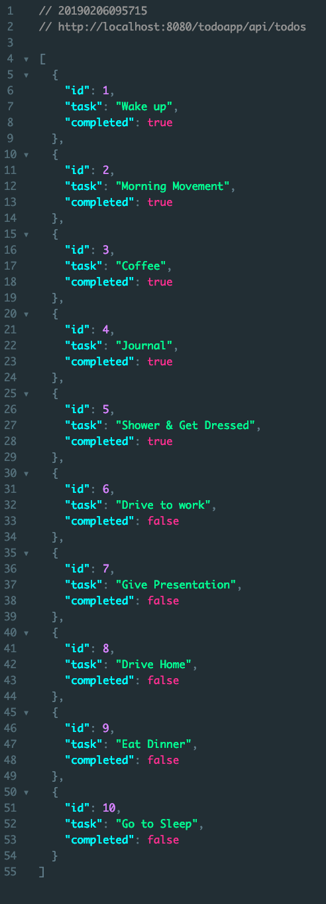
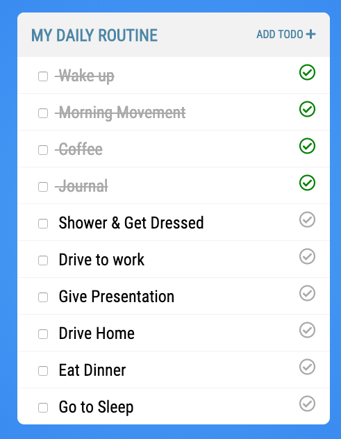

# Creating REST APIs Tutorial: Java

In this directory you will find the folder `todo-rest-java` that contains the starter code for this tutorial. Everything you need to create this application is already in place. The only think you will be building in this tutorial is the controller.

## Starter Code

Before you dive in and create the controller it will help if you understand how this application works. In the package `com.techelevator.todo.model` you will find the class `Todo.java`. This is a Plain Old Java Object (POJO) that represents a Todo. It has 3 properties, a constructor, getters & setters and a to string. Nothing special about this class.

```java
public class Todo {

    private int id;
    private String task;
    private boolean completed;
    
    public Todo() {
    	
    }
    
	public Todo(int id, String task, boolean completed) {
		super();
		this.id = id;
		this.task = task;
		this.completed = completed;
	}

	// getters and setters omitted
}
```

In the package `com.techelevator.todo.dao` you will find the class `TodoDao.java`. Normally the DAO would talk to a database but to keep this application simple you are just going to use a map to store a list of todos.

```java
private Map<Integer,Todo> todos = new HashMap<>();
```

To initialize the map with some todos there is some initial data located in `/src/main/resources/data.json`. This data is initialized when the constructor for the TodoDao is called. Don't worry too much about how this works, just know that it reads the json file and loads an array of todos into memory.

```java
public TodoDao() throws JsonParseException, JsonMappingException, IOException {
    loadJSON();
}

private void loadJSON() throws JsonParseException, JsonMappingException, IOException {
    ObjectMapper mapper = new ObjectMapper();
    InputStream inputStream = Test.class.getResourceAsStream("/data.json");
    Todo[] jsondata = mapper.readValue(inputStream, Todo[].class);
    for(Todo todo : jsondata) {
        todos.put(todo.getId(),todo);
    }
}
```

You will use the TodoDao in your controller. It is important to note that when your application starts up it reads the data into memory (the todos map) so all the changes at runtime are to the in memory map and not the JSON data file. This means that when you restart the application the data will be reset.

## Creating the REST Controller

The first thing you will want to do is create a new class `TodoController` in the package `com.techelevator.todo.controller`. You annotate the class with `@RestController` so that Spring knows this is a controller that does not use any views. You also use the annotation `@RequestMapping` to set base path for all mappings defined in this controller.

```java
@RestController
@RequestMapping("/api/todos")
public class TodoController {

}
```

Next you can define a private property for the TodoDao class. You will then create a constructor with the TodoDao as an argument. Because there is only a single constructor Spring will try to autowire any dependencies that you have defined. Here you are saying I know you have an instance of the TodoDao class (because you marked it as a `@Component`) so please autowire that for me. 

``` java
private TodoDao todoDao;

public TodoController(TodoDao todoDao) {
	this.todoDao = todoDao;
}
```

## List Todos

Now that you have the basic controller created you can focus on created each of the methods you need to make this application work. The first thing you need to do is add an endpoint where you can get a list of all the Todos. The `TodoDao.java` class already has a method that will return a list of Todos.

``` java
// path will be /api/todos
// if you defined @GetMapping("/") or @RequestMapping("/") the path would be /api/todos/ (trailing slash)
@GetMapping
public List<Todo> list() {
	return todoDao.list();
}
```

## Add Todo

Next you need to handle a post request to add a new todo. The `@PostMapping` says that this method will be called when the request method is post and the path is `/api/todos`. The `@ResponseStatus` annotation will return the HttpStatus.CREATED (201) status code. This is good practice when you are creating a new resource.

``` java
@PostMapping
@ResponseStatus(HttpStatus.CREATED)
public Todo create(@RequestBody Todo todo) {
	return todoDao.create(todo);
}
```

## Read Todo

The read method will allow you to pass an id and get back just a single Todo. The curly brackets around `{id}` indicate that this is a path variable and you need to handle it. In the method arguments you declare that id is an int and that you expect it to be in the path `/api/todos/1`. 

``` java
@GetMapping("/{id}")
public Todo read(@PathVariable int id) throws TodoNotFoundException {
	Todo todo = todoDao.read(id);
	if( todo != null ) {
		return todo;
	} else {
		throw new TodoNotFoundException(id,"Todo Not Found!");
	}
}
```

## Update Todo

Next you are going to handle a PUT request. This allows you to update the Todo but in this case the only thing you are updating is the status. Whenever you are using the request method PUT you need to send a long the whole object even if you're updating a single property. 

``` java
@PutMapping("/{id}")
@ResponseStatus(HttpStatus.CREATED)
public Todo update(@RequestBody Todo todo,@PathVariable int id) throws TodoNotFoundException {
	Todo requestedTodo = todoDao.read(id);
	if( requestedTodo != null ) {
		return todoDao.update(todo);
	} else {
		throw new TodoNotFoundException(id,"Todo Not Found!");
	}
}
```

## Delete

You don't actually need the delete method for this application but if you're curious what the code would look like here it is.

``` java
@DeleteMapping("/{id}")
public void delete(@PathVariable int id) {
	todoDao.delete(id);
}
```

## TodoController Solution 

If you followed the tutorial correctly you should end up with a Todo Controller that looks like this:

```java
// package & imports omitted

@RestController
@CrossOrigin
@RequestMapping("/api/todos")
public class TodoController {

	private TodoDao todoDao;

	public TodoController(TodoDao todoDao) {
		this.todoDao = todoDao;
	}

	@GetMapping
	public List<Todo> list() {
		return todoDao.list();
	}

	@GetMapping("/{id}")
	public Todo read(@PathVariable int id) throws TodoNotFoundException {
		Todo todo = todoDao.read(id);
		if( todo != null ) {
			return todo;
		} else {
			throw new TodoNotFoundException(id,"Todo Not Found!");
		}
	}

	@PostMapping
	@ResponseStatus(HttpStatus.CREATED)
	public Todo create(@RequestBody Todo todo) {
		return todoDao.create(todo);
	}

	@PutMapping("/{id}")
	@ResponseStatus(HttpStatus.CREATED)
	public Todo update(@RequestBody Todo todo,@PathVariable int id) throws TodoNotFoundException {
		Todo requestedTodo = todoDao.read(id);
		if( requestedTodo != null ) {
			return todoDao.update(todo);
		} else {
			throw new TodoNotFoundException(id,"Todo Not Found!");
		}
	}

	@DeleteMapping("/{id}")
	public void delete(@PathVariable int id) {
		todoDao.delete(id);
	}

}
```

## Running the Todo Application

If you run the application and visit http://localhost:8080/todoapp/api/todos you should see a list of todos.



## Todo Vue Application

Now that you have your REST API working you need to update the todo application. In the folder `todo` go into `/src/components/TodoList.vue` and update the apiURL to:

```javascript
apiURL: "http://localhost:8080/todoapp/api/todos",
```

Now instead of your todo application using the mock API it's using the API that you just built. If your Spring REST App is already running you can start your Todo Application:

```
npm run serve
```

If everything went ok you should be able to use your Todo app the same way you did in a previous tutorial only this time it's using your own REST API!

;
